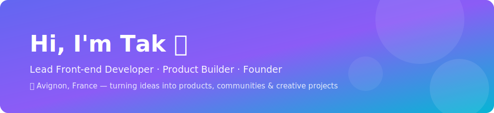
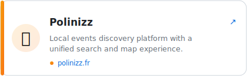
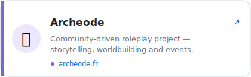
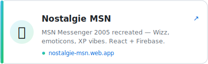
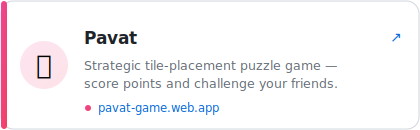
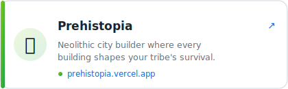
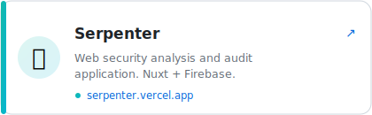
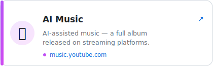
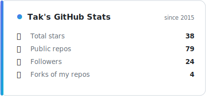
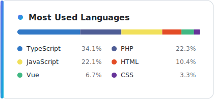

  

I build modern web applications with a strong focus on user experience, accessibility, performance, and scalable front-end architecture. Passionate about product development, AI-driven workflows, and creative technologies, I enjoy turning ideas into products, communities, and creative projects.

## 🚀 Featured Projects

<table>
  <tr>
    <td></td>
    <td></td>
  </tr>
  <tr>
    <td></td>
    <td></td>
  </tr>
  <tr>
    <td></td>
    <td></td>
  </tr>
  <tr>
    <td></td>
    <td></td>
  </tr>
</table>

💻 Nostalgie MSN source: [github.com/TakCastel/nostalgie-msn](https://github.com/TakCastel/nostalgie-msn) · 🎼 Suno profile: [suno.com/@kiravalentine](https://suno.com/@kiravalentine)

## 📊 GitHub Stats

<table>
  <tr>
    <td></td>
    <td></td>
  </tr>
</table>

🔄 Updated weekly by a GitHub Action — no external service.

## 💡 Interests

Product Development · Front-end Architecture · Design Systems · Accessibility · Web Performance · Artificial Intelligence · Community Building · Creative Technologies · Open Source

## 🤝 Connect

