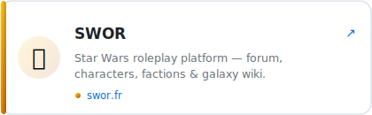

  

**Front-end**

**Back-end & Headless CMS**

**Architecture, DevOps & AI**

**Quality & Tools**

Senior developer specialized in front-end architecture and scalable design systems. I work across the whole technical chain — modern JavaScript stack, headless CMS, DevOps, and technical mentoring — with a constant focus on Core Web Vitals and accessibility. Self-taught and curious, I combine technical rigor with a product mindset, turning ideas into products, communities, and creative projects.

## 🚀 Featured Projects

<table>
  <tr>
    <td></td>
    <td></td>
  </tr>
  <tr>
    <td></td>
    <td></td>
  </tr>
  <tr>
    <td></td>
    <td></td>
  </tr>
  <tr>
    <td></td>
    <td></td>
  </tr>
</table>

💻 Nostalgie MSN source: [github.com/TakCastel/nostalgie-msn](https://github.com/TakCastel/nostalgie-msn) · 🎼 Suno profile: [suno.com/@kiravalentine](https://suno.com/@kiravalentine)

## 📊 GitHub Stats

<table>
  <tr>
    <td></td>
    <td></td>
  </tr>
</table>

## 💡 Interests

* Product Development
* Front-end Architecture
* Design Systems
* Accessibility
* Web Performance
* Artificial Intelligence
* Community Building
* Creative Technologies
* Open Source

## 🤝 Connect

